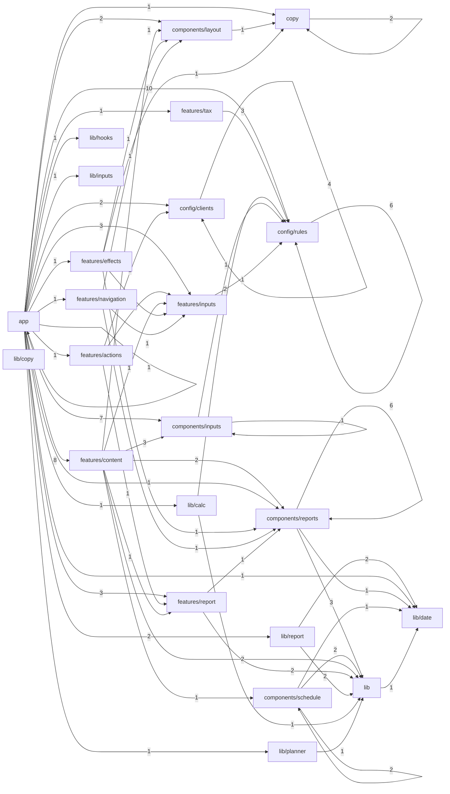

# Repository Dependencies

Generated: `2026-02-20T21:59:17.291Z`

## Summary
- Code files analyzed: **55**
- Internal import edges: **116**
- Unresolved internal imports: **0**

## Layer Dependency Edges
| From Layer | To Layer | Edge Count |
|---|---|---:|
| app | config/rules | 10 |
| app | features/content | 8 |
| app | components/inputs | 7 |
| components/reports | components/reports | 6 |
| config/rules | config/rules | 6 |
| config/clients | config/clients | 4 |
| app | features/inputs | 3 |
| app | features/report | 3 |
| components/reports | lib | 3 |
| features/content | components/inputs | 3 |
| features/tax | config/rules | 3 |
| app | components/layout | 2 |
| app | config/clients | 2 |
| app | lib/report | 2 |
| components/schedule | components/schedule | 2 |
| components/schedule | lib | 2 |
| copy | copy | 2 |
| features/content | components/reports | 2 |
| features/content | lib | 2 |
| features/report | lib | 2 |
| lib/calc | config/rules | 2 |
| lib/report | lib | 2 |
| lib/report | lib/date | 2 |
| app | app | 1 |
| app | components/reports | 1 |
| app | copy | 1 |
| app | features/actions | 1 |
| app | features/effects | 1 |
| app | features/navigation | 1 |
| app | features/tax | 1 |
| app | lib/calc | 1 |
| app | lib/date | 1 |
| app | lib/hooks | 1 |
| app | lib/inputs | 1 |
| app | lib/planner | 1 |
| components/inputs | components/inputs | 1 |
| components/inputs | config/rules | 1 |
| components/layout | copy | 1 |
| components/reports | lib/date | 1 |
| components/schedule | lib/date | 1 |
| features/actions | config/clients | 1 |
| features/actions | features/inputs | 1 |
| features/actions | features/report | 1 |
| features/content | components/layout | 1 |
| features/content | components/schedule | 1 |
| features/content | features/inputs | 1 |
| features/content | features/report | 1 |
| features/effects | components/layout | 1 |
| features/effects | components/reports | 1 |
| features/effects | copy | 1 |
| features/effects | features/inputs | 1 |
| features/inputs | config/rules | 1 |
| features/navigation | components/layout | 1 |
| features/navigation | components/reports | 1 |
| features/navigation | features/inputs | 1 |
| features/report | components/reports | 1 |
| lib | lib/date | 1 |
| lib/calc | lib | 1 |
| lib/planner | lib | 1 |

## Layer Graph

## Most Connected Files
| File | Depends On | Used By | Example Internal Imports |
|---|---:|---:|---|
| src/lib/amortization.ts | 1 | 13 | src/lib/date/formatMonthYear.ts |
| src/components/reports/ReportsHeader.tsx | 0 | 6 | - |
| src/lib/date/formatMonthYear.ts | 0 | 6 | - |
| src/features/planner/inputs/wtaFlow.ts | 1 | 4 | src/config/rules/wtaPovertyLevel.json |
| src/config/clients/index.ts | 4 | 3 | src/config/clients/default.json, src/config/clients/il.json, src/config/clients/tx.json, src/config/clients/ut.json |
| src/copy/index.ts | 2 | 3 | src/copy/en.json, src/copy/es.json |
| src/features/planner/report/reportViewModel.ts | 1 | 3 | src/components/reports/ReportsHeader.tsx |
| src/components/layout/Sidebar.tsx | 0 | 3 | - |
| src/components/reports/ReportWindowToggle.tsx | 0 | 3 | - |
| src/components/inputs/PlannerNoticeCard.tsx | 0 | 2 | - |
| src/components/layout/TopNav.tsx | 0 | 2 | - |
| src/features/planner/inputs/fscFlow.ts | 0 | 2 | - |
| src/components/reports/SummaryView.tsx | 5 | 1 | src/components/reports/ReportsHeader.tsx, src/components/reports/ChartsPanel.tsx, src/components/reports/AbleVsTaxablePanel.tsx, src/components/reports/ReportWindowToggle.tsx |
| src/features/planner/content/ReportsSection.tsx | 4 | 1 | src/components/reports/SummaryView.tsx, src/components/reports/ReportsHeader.tsx, src/lib/amortization.ts, src/features/planner/report/reportViewModel.ts |
| src/features/planner/effects/usePlannerUiEffects.ts | 4 | 1 | src/components/layout/Sidebar.tsx, src/components/reports/ReportsHeader.tsx, src/copy/index.ts, src/features/planner/inputs/wtaFlow.ts |
| src/components/reports/ChartsPanel.tsx | 3 | 1 | src/lib/amortization.ts, src/lib/date/formatMonthYear.ts, src/components/reports/ReportWindowToggle.tsx |
| src/components/schedule/ScheduleView.tsx | 3 | 1 | src/lib/amortization.ts, src/components/schedule/ScheduleHeader.tsx, src/components/schedule/AmortizationScheduleTable.tsx |
| src/features/planner/actions/resetPlannerInputs.ts | 3 | 1 | src/config/clients/index.ts, src/features/planner/inputs/fscFlow.ts, src/features/planner/report/reportViewModel.ts |
| src/features/planner/navigation/mobileNavModel.ts | 3 | 1 | src/components/layout/Sidebar.tsx, src/components/reports/ReportsHeader.tsx, src/features/planner/inputs/wtaFlow.ts |
| src/features/planner/tax/taxMath.ts | 3 | 1 | src/config/rules/federalTaxBrackets.json, src/config/rules/stateTaxDeductions.json, src/config/rules/stateTaxRates.json |
| src/lib/calc/usePlannerSchedule.ts | 3 | 1 | src/lib/amortization.ts, src/config/rules/federalTaxBrackets.json, src/config/rules/stateTaxRates.json |
| src/components/reports/AbleVsTaxablePanel.tsx | 2 | 1 | src/lib/amortization.ts, src/components/reports/ReportWindowToggle.tsx |
| src/components/schedule/AmortizationScheduleTable.tsx | 2 | 1 | src/lib/amortization.ts, src/lib/date/formatMonthYear.ts |
| src/features/planner/content/InputsLeftPane.tsx | 2 | 1 | src/components/inputs/AccountActivityForm.tsx, src/components/inputs/DemographicsForm.tsx |
| src/features/planner/content/ScheduleSection.tsx | 2 | 1 | src/components/schedule/ScheduleView.tsx, src/lib/amortization.ts |

## app/page.tsx Dependency Focus

## Unresolved Internal Imports
None.
